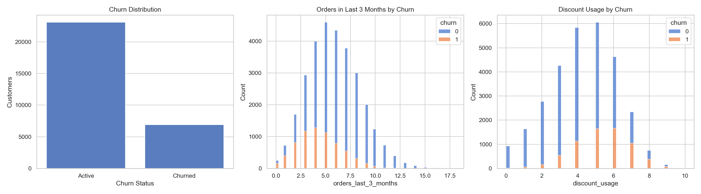
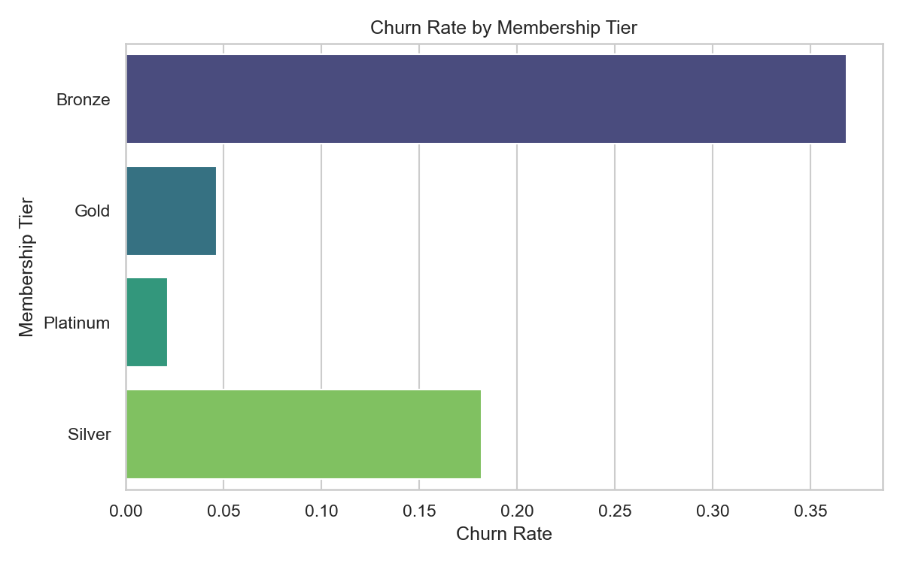
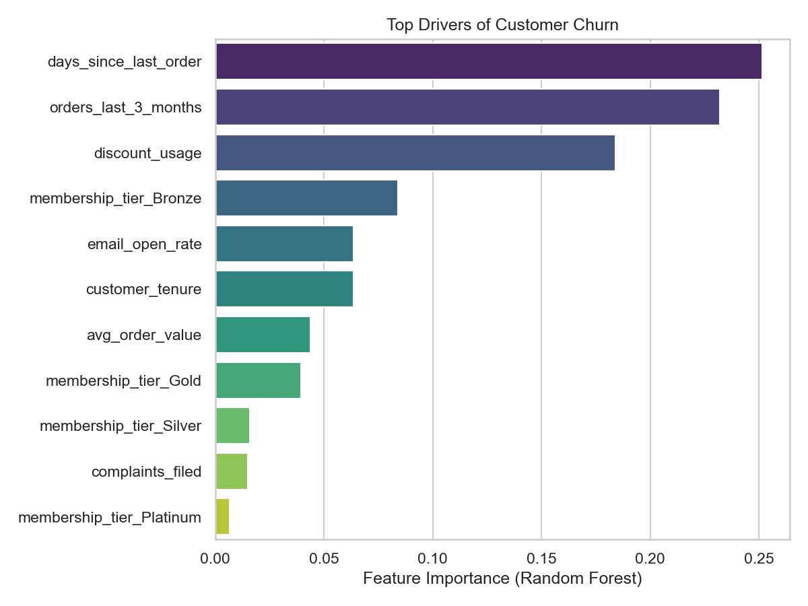

Customer Churn Prediction Model
Predict churn early, retain loyal guests, and grow lifetime value for restaurant and food-delivery programs.

---

Overview
The model analyzes 30k synthetic loyalty profiles that mimic real customer behavior: order frequency, discount usage, tenure, engagement, and complaints. By combining exploratory analysis with two complementary machine learning models, the solution delivers actionable churn scores and segment-level insights marketing teams can act on immediately.

Why It Matters

- Retain existing diners and couriers at a fraction of acquisition cost.
- Reveal which behaviors (inactivity, heavy discounting, email fatigue) drive attrition.
- Equip CRM, marketing, and CX teams with prioritized outreach lists and ROI-ready dashboards.

Highlights

- Dual-model approach: Elastic Logistic Regression baseline plus tuned Random Forest for non-linear patterns.
- SMOTE resampling and class-weighting tackle the natural 77/23 imbalance between active and churned users.
- Automated exports feed campaign tools, BI dashboards, and warehouse tables.
- Insight narrative translates data into plain-language retention recommendations.

Snapshot of the Data & Drivers

Results at a Glance
| Model | Accuracy | Precision | Recall | F1 | ROC-AUC |
| --- | --- | --- | --- | --- | --- |
| Logistic Regression (SMOTE) | 0.772 | 0.503 | **0.777** | **0.611** | **0.860** |
| Random Forest (Tuned) | **0.796** | **0.546** | 0.678 | 0.605 | 0.849 |

Actionable Insights

- High discount reliance plus low order frequency customers churn 2.4× faster; tighten promos and test loyalty perks here first.
- Guests inactive for 85th percentile days are twice as likely to churn; trigger reminder sequences and limited-time offers.
- Bottom-quintile email engagers churn 1.4× baseline; shift to SMS/push or refresh creative for this segment.

Quick Start

1. **Install requirements**: ensure Python 3.11+, then run `pip install -r requirements.txt` (or execute the notebook to auto-install `imbalanced-learn`).
2. **Open the notebook**: run `customer_churn_prediction.ipynb` top-to-bottom for reproducible data generation, EDA, modeling, and exports.
3. **Review exports**: explore `data/customer_churn_predictions.csv`, `data/dashboard_customer_churn_view.csv`, and `data/insight_summary.csv` for ready-to-use outputs.
4. **Load into BI/CRM**: use `sql/churn_data_import.sql` to load predictions into your warehouse and plug them into dashboards or marketing automations.

Deliverables

- `customer_churn_prediction.ipynb` – end-to-end pipeline with narrative commentary.
- `data/customer_churn_predictions.csv` – scored customers with probability of churn.
- `data/dashboard_customer_churn_view.csv` – enriched fact table for BI dashboards.
- `data/segment_summary_for_dashboard.csv` – churn KPIs by membership tier.
- `data/insight_summary.csv` – plain-English retention playbook by segment.
- `sql/churn_data_import.sql` – reusable warehouse schema + sample campaigns.

Interpretability & Governance

- Feature importances surface the behaviors driving attrition, supporting stakeholder trust.
- Transparent preprocessing pipelines (imputation, scaling, one-hot encoding) ensure repeatability.
- SMOTE configuration and hyperparameters are documented within the notebook for auditability.

Roadmap Ideas

- Add Gradient Boosting/XGBoost and calibration plots for uplift-driven campaigns.
- Layer in real CRM attributes (channel preferences, satisfaction scores) once available.
- Publish a Streamlit or Plotly dashboard (stretch goal) for interactive retention planning.

🤝 Get Involved
Questions or collaboration ideas? Open an issue or reach out—let’s keep more loyal diners delighted while optimizing spend.
